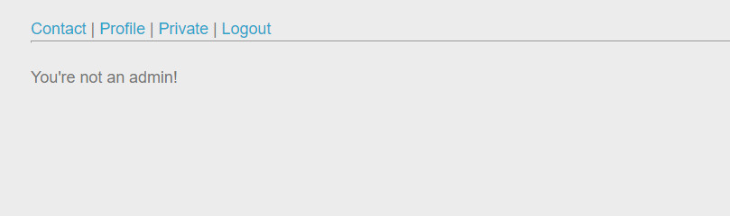
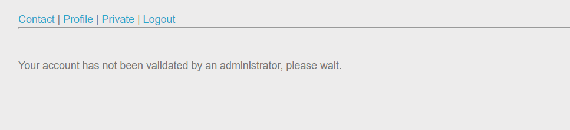
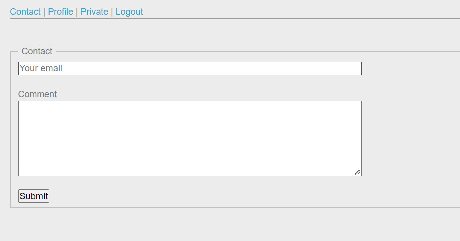
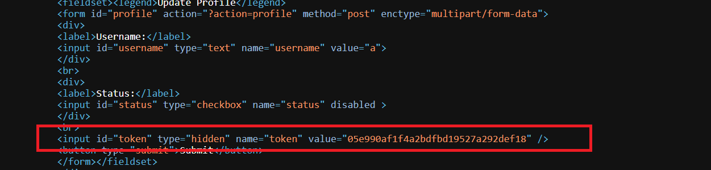
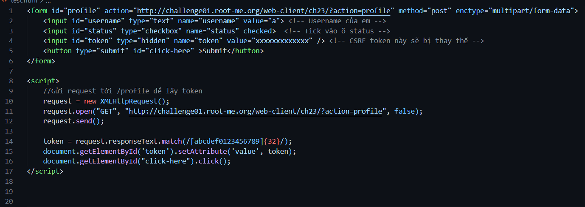
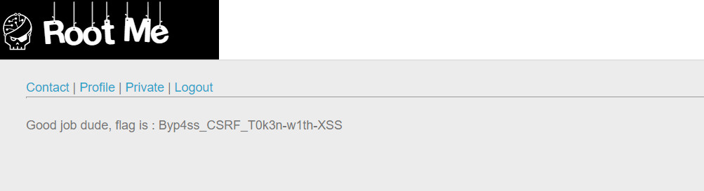

```diff
@@ Web-Client Challenge @@
```

## CSRF - Token Bypass [45 Points]

* Mục tiêu của challenge này là tìm cách **activate** tài khoản của mình để xem được nội dung ***private***. Tuy nhiên chỉ có admin mới được phép thực hiện hành động activate này, nên ta sẽ tấn công CSRF để admin thực hiện việc đó ngoài ý muốn.

  

  

* Sau khi login, ta thấy có chức năng gửi email tới admin và admin sẽ kiểm tra email, vậy ta sẽ tạo payload ở đây và gửi tới admin.

  

* Nội dung payload sẽ là khiến admin tự động gửi form trong phần /profile và tick vào status cho account của chúng ta. Mở form đó lên ta thấy nó có chứa CSRF token (one-time token)

  

* Để bypass token này, thì ta sẽ viết script request tới trang profile => lấy token => Bỏ token vào fake form và thực hiện post form đó lên server

  Script như sau

  

* Gửi email với nội dung là script trên đến admin và ta có được flag khi truy cập vào trang private

  