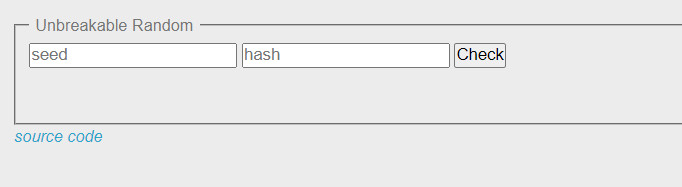
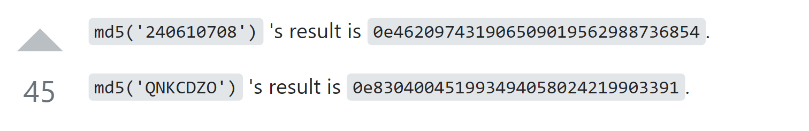
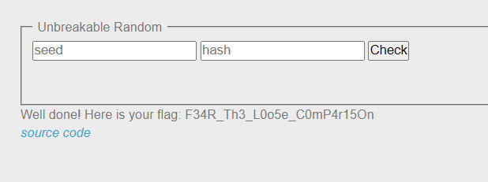

```diff
@@ Web-Server Challenge @@
```

## PHP - Loose Comparison [30 Points]

- Challenge là một form để điền hai giá trị *seed* và *hash* như sau:

  

- Ngoài ra nó còn cho ta xem source code xử lý 2 dữ liệu input

  ```php+HTML
  <html>
  <body>
   <form action="index.php" class="authform" method="post" accept-charset="utf-8">
          <fieldset>
              <legend>Unbreakable Random</legend>
              <input type="text" id="s" name="s" value="" placeholder="seed" />
              <input type="text" id="h" name="h" value="" placeholder="hash" />
              <input type="submit" name="submit" value="Check" />

          <div class="return-value" style="padding: 10px 0">&nbsp;</div>
          </fieldset>
          </form>
  <?php
  function gen_secured_random() { // cause random is the way
      $a = rand(1337,2600)*42;
      $b = rand(1879,1955)*42;

      $a < $b ? $a ^= $b ^= $a ^= $b : $a = $b;

      return $a+$b;
  }

  function secured_hash_function($plain) { // cause md5 is the best hash ever
      $secured_plain = sanitize_user_input($plain);
      return md5($secured_plain);
  }

  function sanitize_user_input($input) { // cause someone told me to never trust user input
      $re = '/[^a-zA-Z0-9]/';
      $secured_input = preg_replace($re, "", $input);
      return $secured_input;
  }

  if (isset($_GET['source'])) {
      show_source(__FILE__);
      die();
  }


  require_once "secret.php";

  if (isset($_POST['s']) && isset($_POST['h'])) {
      $s = sanitize_user_input($_POST['s']);
      $h = secured_hash_function($_POST['h']);
      $r = gen_secured_random();
      if($s != false && $h != false) {
          if($s.$r == $h) {
              print "Well done! Here is your flag: ".$flag;
          }
          else {
              print "Fail...";
          }
      }
      else {
          print "<p>Hum ...</p>";
      }
  }
  ?>
  <p><em><a href="index.php?source">source code</a></em></p>
  </body>
  </html>
  ```

- Ở đây, ta thấy, để có thể xem được flag thì ```$s nối với $r``` phải bằng ```$h```. Chú ý rằng ở đây trang web sử dụng ```==``` chứ không phải ```===``` , Điều dẫn tới lỗi ở đây. Ta có thể tìm thấy các trường hợp đặc biệt của việc sử dụng loose comparision trong php tại [link này](https://www.php.net/manual/en/types.comparisons.php).

- Ta có seed sẽ được concat với random sau đó so sánh với md5(hash) .

-  Mà trong PHP, 0exxxx sẽ được hiểu là 0 mũ xxxxx, và kết quả tất nhiên bằng 0. 

- Vậy ta cần tìm một chuỗi có hash md5 có dạng 0exxxx để paste vào ô hash và ô seed chỉ cần nhập 0e. Hai vế của phép so sánh đều bằng 0 và tất nhiên là bằng nhau

- Em tìm thấy trên stackoverflow có chuỗi sau

- Và kết quả thu được với seed = 0e và hash = 240610708

  