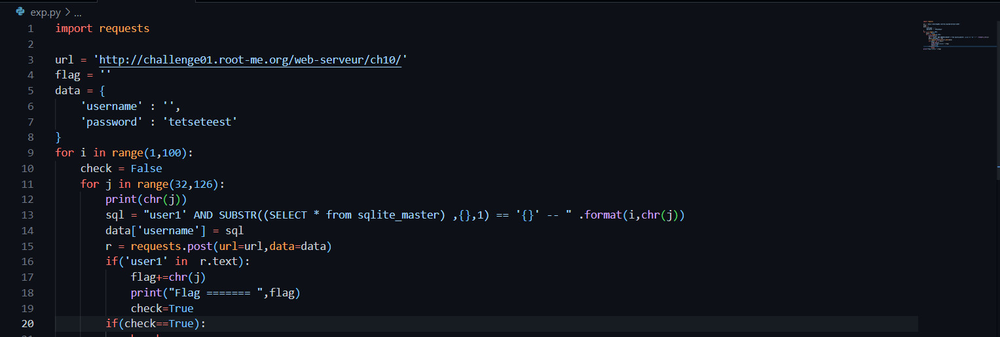

```diff
@@ Web - server Challenge @@
```

## SQL injection - Blind [50 Points]

* Mục tiêu của Challenge này là thực thi SQLi thông qua việc Login. Vào challenge ta thấy nó cho ta giao diện như sau:

  

* Thử inject với payload ```a' or 1=1 -- ``` vào phần password thì thấy kết quả là ta đã đăng nhập được, kết quả trả về như sau.

  

* Ta chú ý rằng query được thực thi thành công vì trong câu truy vấn trên server có chứa điều kiện luôn luôn đúng là 1=1. Nếu vị trí đó là một mệnh đề IF đúng thì kết quả cũng sẽ như thế. Vậy ta dựa vào đây để khai thác Blind SQLi đọc nội dung lưu trong database bằng cách đoán.

* Thử lại với payload Blind SQLi đối với database là MySQL thì thấy báo lỗi vì database này là SQLite

  

* Ta viết payload sau để thực hiện tự động brute-force table_name

  

* Và kết quả là table_name = users

* Thay vì brute-force tên các cột, em đoán xem cột username và password có tồn tại hay không với payload ```user1' AND SUBSTR((SELECT password from users where username='admin') ,1,1) == 'u' -- ```, ta thấy request ok (Khi không có lỗi sqlite nào pop up ra).

* Sửa lại script để lấy password của admin

  

* Kết quả ta thu được password, dùng nó để pass challenge

  
