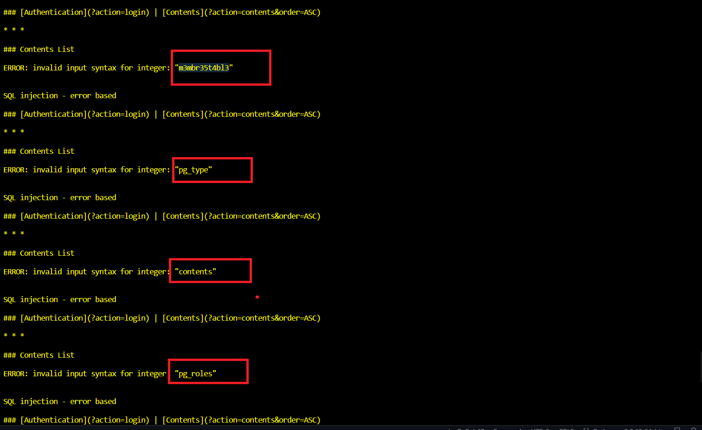

```diff
@@ Web-Server Challenge @@
```

## SQL injection - Error [40 Points]

* Challenge cung cấp cho ta một giao diện như sau

  

* Thử đăng nhập với các payload SQLi kể cả đúng hay cố tình sai cú pháp đều nhận về dòng chữ "login failed"

  

* Thử chuyển sang trang ```Content``` thì thấy ngoài việc nó buộc ta đăng nhập để cho phép đọc nội dung, thì nó còn nhận một tham số thú vị khác là ```order=ASC```

  

* Biết được ASC là chỉ thị trong SQL để sắp xếp các records, ta thử inject vào vị trí này với payload ```union select 1```

  

* Như hình trên thì ta thấy nó có thông báo lỗi xuất ra, câu truy vấn bên phía server là  ```SELECT * FROM contents order by page ASC```. Ta thử sửa giá trị của tham số order từ ASC thành 1 câu truy vấn kiểu như ```,(SELECT 1)``` thì lúc đó bên server sẽ thực hiện ```SELECT * FROM contents order by page, (1)```. Kết quả là truy vấn vẫn hoạt động bình thường

  

* Nhưng như thế này vẫn chưa thu được nhiều thông tin lắm, ta phải chỉnh sửa cho nó có Error (kèm theo thông tin nhạy cảm). Tìm kiếm Payload trên mạng, em tìm thấy đoạn này

  

* Nếu chuỗi để CAST sang integer không hợp lệ (chứa các ký tự không phải số) thì nó sẽ hiện ra Error có cái chuỗi của ta trong đó. Sửa lại payload của chúng ta như sau

  ```,(CAST((select table_name from information_schema.tables ) AS INT))```

* Và kết quả là 

  

* Thử dùng LIMIT 1 để bypass chỗ này, ta thấy truy vấn thành công

  ```,(CAST((select table_name from information_schema.tables limit 1) AS INT))```

  

* Nhưng có vẻ còn nhiều bảng khác, thử dùng OFFSET kết hợp với LIMIT thì ta thấy có các bảng sau

  

* Có vẻ bảng ta cần xem thông tin là cái đầu tiên, thử xem các cột của nó ta thấy

  

* Đọc các records trong column password ta có kết quả

  

