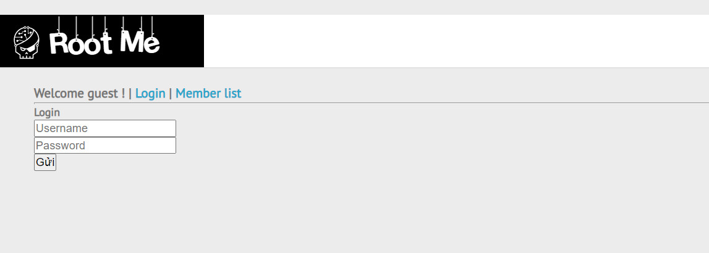
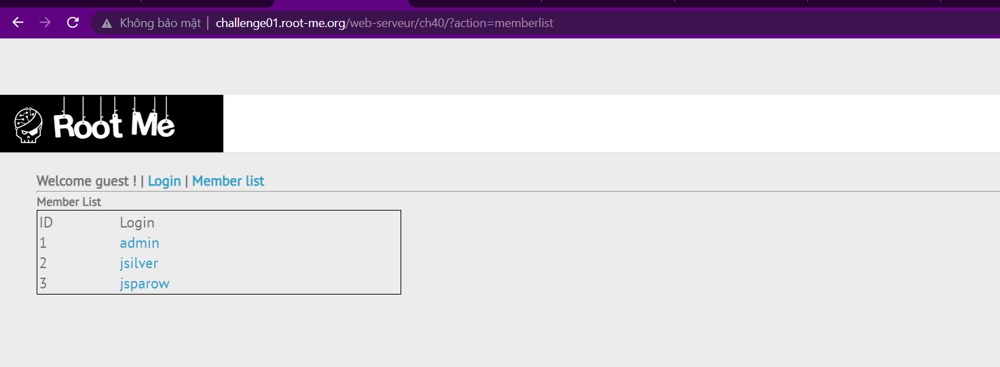
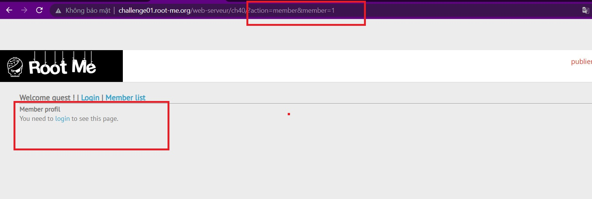
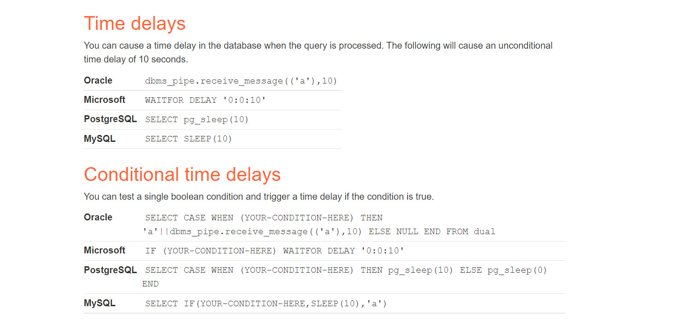
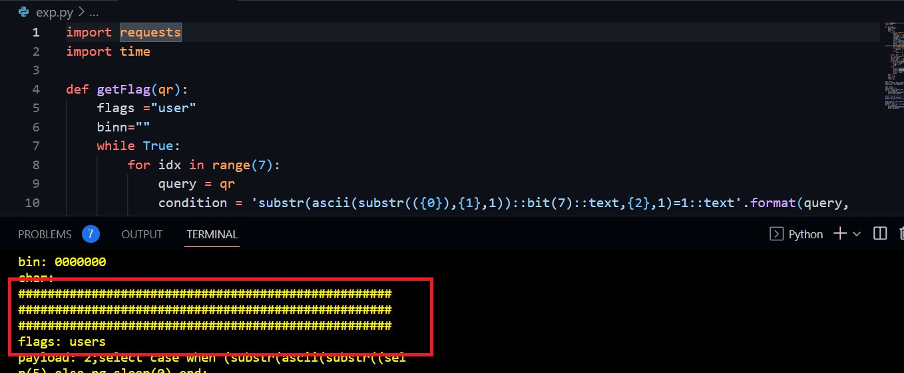
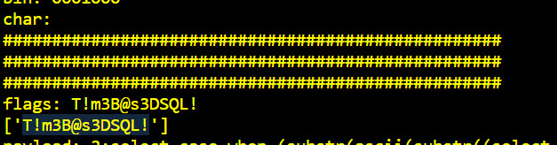

```diff
@@ Web-server Challenge
```

## SQL injection - Time based [45 Points]

* Challenge cung cấp cho ta trang đăng nhập như sau

  

* Thử các payload SQLi cho phần login đều thất bại, ta thử chuyển sang ```Member list``` thử

  

* Với mỗi user trong list, khi ta click vào thì server sẽ nhận giá trị của tham số ```member``` trên đường dẫn để hiện profile của user đó (bắt buộc đăng nhập mới được xem)

  

* Vì đề bài là Time based, nên ta thử tấn công time based ngay tại tham số này. Thử các payload Time based SQLi mà ta có thể tìm được ở [cheat sheet này](https://portswigger.net/web-security/sql-injection/cheat-sheet), ta phát hiện được trang web sử dụng hệ quản trị cơ sở dữ liệu là PostgreSQL

  

* Bắt đầu xây dựng payload để khai thác table name và column name

  

* Thu được kết quả table_name = ```users``` 

  

* Và thu được các column như hình trên (và còn nữa, nhưng nhiều quá nên em đã ngắt script tại đây)

* Kết quả là lấy được password của tài khoản admin

  